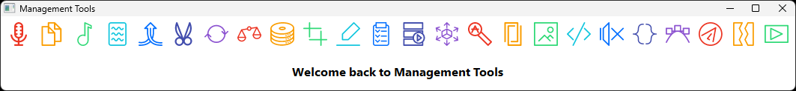

# MaTools: A Comprehensive Management Toolkit


[](https://github.com/Inc44/MaTools/issues?q=is%3Aopen+is%3Aissue)

[](https://github.com/Inc44/MaTools/releases)
[](https://github.com/sponsors/Inc44)

MaTools is an all-in-one GUI application, created using PyQt6, that offers a suite of tools for various tasks, all within an efficient, user-friendly interface.



## 🌟 Features

- 🎵 Audio Speech Recognition*
- 📖 Optical Character Recognition
- 🎧 YouTube Audio Downloader
- 📝 PDF Merger
- 🎨 SVG to PNG Converter
- 🎬 FFmpeg Video Trim
- 🐍 Python Code Formatter
- 📂 File Sync
- 📅 Media Date Organizer
- 🔇 Silence Remover
- 🖼️ Image Trimmer
- 🛠️ And much more!

\* I would advise pre-processing the audio using [Ultimate Vocal Remover](https://github.com/Anjok07/ultimatevocalremovergui)

## 🚀 Installation

### With Conda

```bash
conda create -n MaTools python=3.13 -y
conda activate MaTools
```

### From Source

```bash
git clone https://github.com/Inc44/MaTools.git
cd MaTools
```

To install only the dependencies:

```bash
pip install -r requirements.txt
```

To install whisperX:

```bash
conda create -n whisperx python=3.13 -y
conda activate whisperx
pip install torch==2.8.0 --index-url https://download.pytorch.org/whl/cu129
pip install whisperx
```

To install OCRmyPDF:

```bash
conda create -n ocrmypdf python=3.13 -y
conda activate ocrmypdf
pip install torch==2.9.0 --index-url https://download.pytorch.org/whl/cu129
pip install ocrmypdf
pip install ocrmypdf-easyocr
```

To install belilo:

```bash
cd management_tools/belilo_pyo3
cargo build --release
```

```bash
mv target/release/belilo_pyo3_lib.so ../belilo_pyo3.pyd
```

```cmd
move target\release\belilo_pyo3_lib.dll ..\belilo_pyo3.pyd
```

To install rusty_scissors:

```bash
cd management_tools/rusty_scissors_pyo3
cargo build --release
```

```bash
mv target/release/rusty_scissors_pyo3_lib.so ../rusty_scissors_pyo3.so
```

```cmd
move target\release\rusty_scissors_pyo3_lib.dll ..\rusty_scissors_pyo3.pyd
```

Ensure these binaries are in your system's PATH, e.g., `C:\Windows\`:

- `ect.exe` - Version 0.9.5 tested
- `exiftool.exe` (and its DLLs) - Version 13.39 tested
- `ffmpeg.exe` - Version 8.0 tested
- `unpaper.exe` (and its DLLs) - Version 6.1 tested
- `yt-dlp.exe` - Version 2025.10.14 tested

## 📖 Usage Examples

### Command-Line:

```bash
python -OO main_management_tools_app.pyw
```

### Linux shortcut:

```bash
~/miniconda3/envs/MaTools/bin/python -OO ~/github/MaTools/management_tools/main_management_tools_app.pyw
```

### Windows shortcut:

```cmd
C:\ProgramData\miniconda3\envs\MaTools\pythonw.exe -OO D:\github\MaTools\management_tools\main_management_tools_app.pyw
```

### Check downloaded necessary binaries' presence in system PATH

```bash
ect
exiftool -ver
ffmpeg -version
yt-dlp --version
unpaper --version
```

## 🛠️ Usage

After launching, the toolbar at the top showcases icons for various tools. Hover over an icon to see its description. Click to activate the respective tool.

## 🎨 Customization

MaTools allows theme tweaks. To modify the theme, adjust the `theme_name` variable in the main script:

```python
theme_name = "white_flat_theme"  # Choose your preferred theme
```

## 🙏 Thanks

Creators of:

- [Anaconda](https://www.anaconda.com/download) - Conda GUI and [Miniconda](https://docs.conda.io/projects/miniconda/en/latest) - Conda CLI
- [Efficient Compression Tool](https://github.com/fhanau/Efficient-Compression-Tool.git) - Photo compressor
- [ExifTool](https://exiftool.org/) - Metadata processor
- [FFmpeg](https://www.gyan.dev/ffmpeg/builds/) - Media processor
- [Python](https://www.python.org) - Programming language
- [Rust](https://www.rust-lang.org) - Programming language
- [Tesseract](https://github.com/UB-Mannheim/tesseract/wiki) - OCR processor
- [Unpaper](https://github.com/rodrigost23/unpaper/releases) - OCR preprocessor
- [yt-dlp](https://github.com/yt-dlp/yt-dlp.git) - Media downloader

## 🤝 Contribution

Contributions, suggestions, and new ideas are heartily welcomed. If you're considering significant modifications, please initiate an issue for discussion before submitting a pull request.

## 📜 License

[](https://opensource.org/licenses/GPL-3.0)

This project is licensed under the GPL-3.0 License. See the [LICENSE](LICENSE) file for details.

## 💖 Support

[](https://buymeacoffee.com/xamituchido)
[](https://ko-fi.com/inc44)
[](https://www.patreon.com/Inc44)