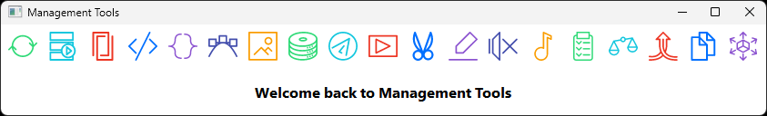

# MaTools: A Comprehensive Management Toolkit

MaTools is an all-in-one GUI application, created using PyQt6, that offers a suite of tools for various tasks, all within an efficient, user-friendly interface.



## 🌟 Features

- 📂 File Sync
- 📅 Media Date Organizer
- 📝 PDF Merger
- 🐍 Python Code Formatter
- 🧹 Sort Lines
- 🎨 SVG to PNG Converter
- 🛠️ And more!

## 🚀 Getting Started

### Prerequisites

- Python 3.10 or 3.11 (should also be compatible with lower versions)
- Required Python packages (install with `pip install -r requirements.txt`)

### Installation Steps

1. **Clone the Repository**
    ```bash
    git clone https://github.com/Inc44/MaTools.git
    ```

2. **Navigate into Project Directory**
    ```bash
    cd MaTools
    ```

3. **Install Dependencies**
    ```bash
    pip install -r requirements.txt
    ```

4. **Launch the Application**
    ```bash
    python main_management_tools_app.pyw
    ```

### Links

- [Efficient Compression Tool GitHub Repository](https://github.com/fhanau/Efficient-Compression-Tool.git)
- [ExifTool Website](https://exiftool.org/)
- [FFmpeg Builds](https://www.gyan.dev/ffmpeg/builds/)
- [yt-dlp GitHub Repository](https://github.com/yt-dlp/yt-dlp.git)

### Required System Binaries

Ensure the following binaries are installed and accessible in your system's PATH:

- `ect.exe` (Version 0.9.4 tested)
- `exiftool.exe` (Version 12.59 tested)
- `ffmpeg.exe` (Version 6.0 tested)
- `yt-dlp.exe` (Version 2023.07.06 tested)

#### Adding Binaries to System Path

1. Download the required binaries.
2. Place them in a directory included in your system's PATH, e.g., `C:\Windows\`.

Verify their availability by running:

```bash
ect.exe --version
exiftool.exe -ver
ffmpeg.exe -version
yt-dlp.exe --version
```

## 🛠️ Usage

Upon launch, the top toolbar displays icons representing different tools. Hover over an icon for a tooltip explaining its function. Click an icon to use that particular tool.

## 🎨 Customization

MaTools supports theme customization. To change the theme, modify the `theme_name` variable in the main Python file:

```python
theme_name = "white_flat_theme"  # Switch to another theme of your choice
```

## 🤝 Contributing

We welcome pull requests! For significant changes, please open an issue for discussion before making a pull request.

## 📜 License

This project is licensed under the MIT License. For details, please refer to the [LICENSE.md](LICENSE.md) file.
